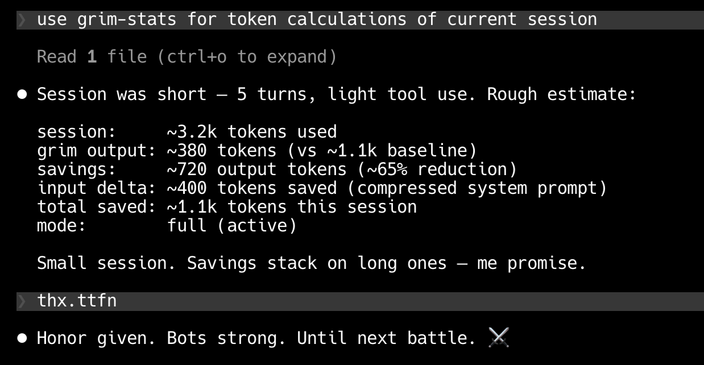

# Installing grimTalk — Claude Code



## Prerequisites

- [Claude Code](https://claude.ai/code) installed
- Python 3.10+ (for `grim-compress` only; all other sub-skills are model-driven)


## Install

From the project root:

```bash
bash agents/claude/install.sh
```

Reinstall (overwrite existing): `--force`
Remove: `--uninstall`

## What it writes

| Path | Purpose |
|------|---------|
| `~/.claude/skills/grimTalk/` | Skill files (SKILL.md + references/) |
| `~/.claude/settings.json` | Wires `SessionStart` + `UserPromptSubmit` hooks |

Restart Claude Code after install to activate.

## Verify

grimTalk activates automatically on session start. You should see the warrior-bot tone on first response. Run `/grim-help` to confirm sub-skills loaded.

## Uninstall

```bash
bash agents/claude/install.sh --uninstall
```

Removes skill files and hook entries from `~/.claude/settings.json`.
