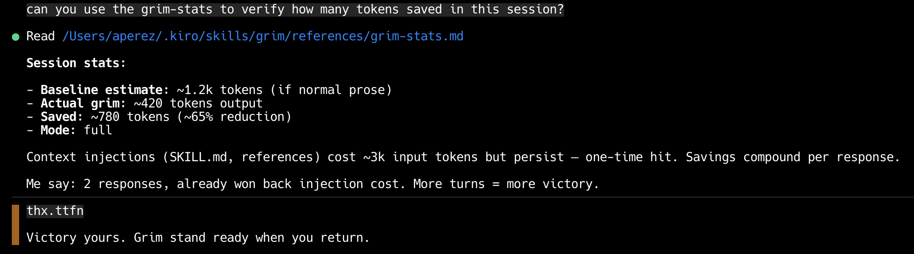

# Installing grimTalk — Kiro CLI



## Prerequisites

- [Kiro CLI](https://kiro.dev) installed

## Install

From the project root:

```bash
bash agents/kiro/install.sh
```

Reinstall (overwrite existing): `--force`
Remove: `--uninstall`

## What it writes

| Path | Purpose |
|------|---------|
| `~/.kiro/skills/grimTalk/` | Skill files (SKILL.md + references/) |
| `~/.kiro/agents/grimTalk.json` | Agent config |

Restart Kiro after install to activate.

## Verify

Start Kiro with the grimTalk agent:

```bash
kiro-cli chat --agent grimTalk
```

Run `grim-help` to confirm sub-skills loaded.

## Optional config

Set grimTalk as the default agent:

```bash
kiro-cli settings chat.defaultAgent grimTalk
```

## Uninstall

```bash
bash agents/kiro/install.sh --uninstall
```

Removes skill files and agent config from `~/.kiro/`.
